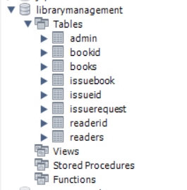

# 📚 Library Management System

A full-featured Library Management System built using **Java**, **JSP/Servlets**, and **MySQL** to streamline book inventory, borrowing, and member management.

---

## 📌 Table of Contents

- [Features](#features)
- [Tech Stack](#tech-stack)
- [Project Structure](#project-structure)
- [Database Schema](#database-schema)
- [Setup Instructions](#setup-instructions)
- [Screenshots](#screenshots)


---

## Features

- 📘 Add, update, and delete books
- 👥 Manage library members
- 📖 Issue and return books
- 🔎 Search functionality for books and members
- 📊 View issued books and history
- 🛡️ Login authentication for admin/librarian

---

## Tech Stack

- **Backend:** Java, Servlet, JSP
- **Frontend:** HTML, CSS, JavaScript (basic)
- **Database:** MySQL
- **Tools:** Apache Tomcat, JDBC, Git

---

## Project Structure

```plaintext
LibraryManagementSystem/
│
├── src/
│   ├── com.library.controller/       # Servlet controllers
│   ├── com.library.dao/              # Data Access Objects (DB logic)
│   ├── com.library.model/            # JavaBeans/POJOs
│
├── WebContent/
│   ├── css/                          # Stylesheets
│   ├── js/                           # JavaScript files
│   ├── images/                       # Assets
│   ├── pages/                        # JSP pages
│   └── index.jsp                     # Home / Login page
│
├── lib/                              # External JARs (MySQL Connector etc.)
├── .classpath
├── .project
└── README.md
```
## Database Schema

📂 Database Schema
The application uses a MySQL database named librarymanagement which contains the following main tables:

admin – Stores administrator login credentials.

books – Contains information about all the books in the library.

readers – Stores data about library members.

issuebook – Tracks which books are issued to which readers, along with issue and return dates.

issuerequest – Logs requests made by readers to borrow books.

- 

## Setup Instructions

🛠️ Setup Instructions
Follow these steps to set up and run the project locally:

1. 🔃 Clone the Repository

git clone https://github.com/bilwa2023/Library-Managing-Application.git
cd Library-Managing-Application

3. 💽 Import into Eclipse (or any Java IDE)
Open Eclipse IDE.
Go to File → Import → Existing Projects into Workspace.
Browse to the cloned project folder and Finish.

4. ⚙️ Configure Apache Tomcat
Download and set up Apache Tomcat (version 8 or above recommended).

In Eclipse:
- Go to Servers tab → New → Server → choose Tomcat.
- Add your project to the server and start it.

4. 🧩 Add Required Libraries
Ensure the following JAR files are in your project’s lib/ folder:
mysql-connector-java.jar (for database connection)

If not present, download and add to your Build Path.

5. 🛢️ Set Up MySQL Database
Open MySQL Workbench or any client.

Create a new schema/database (e.g., librarymanagement).

Execute the SQL script or manually create tables based on your ER diagram.

Update your DB config in the code:
String url = "jdbc:mysql://localhost:3306/librarydb";
String username = "root";
String password = "your_password";

6. ▶️ Run the Project
Right-click the project → Run on Server.

Open your browser and go to:
http://localhost:8080/LibraryManagementSystem/

## Screenshots


